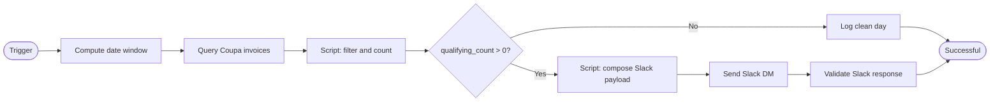

# Solution Design Document — No-PO Invoice Chaser API Workflow

## Document History

| Date | Version | Author | Role | Comments |
|---|---|---|---|---|
| 2026-09-22 | 1.0 | uipath-architect | Architect | Initial SDD generated from PDD JACTIV-725 |

<!-- DO NOT RENAME: uipath-planner detects SDDs via this exact heading or the marker below. -->
<!-- planner-handoff:v1 -->
## Planner Handoff

| Field | Value |
|---|---|
| **Status** | ready |
| **Execution autonomy** | autonomous |
| **Delivery model** | cloud |
| **SDD scope** | single-product |
| **Project list section** | §7 |
| **Tasks file** | `no-po-invoice-chaser-tasks.md` |
| **Generated by** | uipath-planner |
| **Generation date** | 2026-09-22 |
| **Template validation** | passed |

## 1. API Workflow Overview

| Field | Value |
|---|---|
| **API Workflow name** | no-po-invoice-chaser-api |
| **Solution name** | no-po-invoice-chaser-725 |
| **Objective** | Query Coupa each weekday for draft/new invoices from the past seven days, count those with no properly linked PO, and send one Slack Block Kit DM to the AP SME when the count exceeds zero; send nothing on a clean day |
| **Primary use case** | Integration — scheduled read, filter, count, notify |
| **Invocation pattern** | Orchestrator time trigger — weekdays 10:00 Europe/Bucharest; serverless execution |
| **Source PDD** | `docs/pdd-jactiv-725-no-po-invoice-chaser.md` |
| **Delivery model** | Automation Cloud, EU region, modern folders (org architectural considerations §1) |

### Assumptions

- The Orchestrator schedule is configured for Mon–Fri only in Europe/Bucharest timezone; the workflow itself does not guard against weekend triggers (BR-01).
- Both Integration Service connections (`coupa-uipath-test`, `slack-product-test-app`) are authorised and reachable at run time. The Coupa connection reports a failed ping but is confirmed working against the live tenant (org architectural considerations §4).
- Coupa PO linkage is determined by the presence of a non-null `po-number` or `order-header-num` on at least one invoice line in the response. A PO number found only in the invoice header description field does not satisfy BR-02.
- The Block Kit payload resolves `${invoiceCount}`, `${coupaUrl}`, `${windowStart}`, `${windowEnd}` and `${runDate}` from workflow variables at composition time; the payload is built in a Script step before the Slack call.
- Date format for `windowStart` / `windowEnd` in the Coupa query is `YYYY-MM-DD` (verified against live tenant, org architectural considerations §4). Date format in the Slack footer is `YYYY-MM-DD` [ARCHITECT REVIEW — OQ-08: confirm readable date format with SME].
- The Coupa test hostname `uipath-test.coupahost.com` is the DEV/UAT target. Production hostname is [ARCHITECT REVIEW — OQ-05: must be confirmed before go-live].
- Pagination: the Coupa query uses `limit=50`. If the live result set exceeds 50 invoices, additional pages must be fetched. Volume is unconfirmed [ARCHITECT REVIEW — OQ-09: confirm typical and peak daily volume to determine whether pagination is required].
- No retry logic is implemented (BR-08, BR-09). A failing run is a failed Orchestrator job with no secondary notification.
- OQ-02 clean-day contradiction: BR-07 and the scope table are authoritative — no Slack message is sent when `qualifying_count = 0` [ARCHITECT REVIEW — OQ-02: SME must confirm whether a clean-day message is required].
- OQ-03 Block Kit JSON: the payload defined in org architectural considerations §4 is the canonical source. No further confirmation needed from the SME unless the wording must change [ARCHITECT REVIEW — OQ-03: confirm verbatim wording is accepted].

## 2. Input Schema

This workflow is triggered by an Orchestrator time schedule; it takes no caller-supplied input arguments. All runtime values are computed internally.

| Field | Type | Required | Description | Example |
|---|---|---|---|---|
| _(none)_ | — | — | Trigger is schedule-only; no input parameters | — |

### Sample Input

```json
{}
```

## 3. Output Schema

The workflow produces no structured return value to a caller. Its side effect is a Slack DM when `qualifying_count > 0`. Orchestrator job status (`Successful` / `Failed`) is the observable output.

| Field | Type | Always Present | Description | Example |
|---|---|---|---|---|
| `status` | string | YES | Orchestrator job completion status | `"Successful"` |
| `qualifying_count` | integer | YES | Count of invoices with no linked PO, logged to job log | `194` |
| `slack_sent` | boolean | YES | Whether a Slack message was dispatched this run, logged to job log | `true` |

### Sample Output

```json
{
  "status": "Successful",
  "qualifying_count": 194,
  "slack_sent": true
}
```

## 4. Execution Flow



### Step Details

| # | Step | Activity Type | Input | Output | Notes |
|---|---|---|---|---|---|
| 1 | Compute date window | Script | System date (`Date.now()`) | `windowStart` (run date − 7 days, `YYYY-MM-DD`), `windowEnd` (run date, `YYYY-MM-DD`), `runDate` (`YYYY-MM-DD`) | Produces the three date variables used in the Coupa query and Slack footer. BR-04 |
| 2 | Query Coupa invoices | HTTP Request (connector) | `windowStart`, `windowEnd`; query params `status[in]=draft,new`, `invoice-date[gt_or_eq]`, `invoice-date[lt_or_eq]`, `limit=50` | `HTTP_Request_Coupa.content` (array of invoice objects), `HTTP_Request_Coupa.statusCode` | Connection: `coupa-uipath-test` (`5fadfc73-a372-46ae-a27c-2481741eed07`). Resource path: `invoices`. Method: GET. Non-200 response raises an unhandled exception → Orchestrator Failed (S1, BR-08). Each invoice object includes header fields (`status`, `invoice-date`, `invoice-type`, `description`) and nested `invoice-lines[]` with `po-number` / `order-header-num`. If volume exceeds 50, pagination is required [ARCHITECT REVIEW — OQ-09]. |
| 3 | Filter and count | Script | `HTTP_Request_Coupa.content` (invoice array) | `qualifyingCount` (integer), `exclusionLog` (string, informational) | Apply all filters in one pass: (a) exclude where `invoice-type` equals `"Credit Note"` (BR-03, B1); (b) exclude where any invoice line has a non-null, non-empty `po-number` or `order-header-num` (BR-01, BR-02, B2); (c) retain all others. `qualifyingCount` = count of retained invoices. Exclusions logged at Information level [DEFAULT] (org architectural considerations §7). |
| 4 | Branch on count | IF | `qualifyingCount` | Branch: `> 0` → step 5; `= 0` → step 7 | BR-05, BR-07, B3 |
| 5 | Compose Slack payload | Script | `qualifyingCount`, `windowStart`, `windowEnd`, `runDate` | `slackPayload` (JSON string), `coupaUrl` (string) | Build `coupaUrl` = `https://uipath-test.coupahost.com/invoices?q%5Binvoice_date_gteq%5D=${windowStart}&q%5Binvoice_date_lteq%5D=${windowEnd}&q%5Bstatus_eq%5D=draft` (BR-06). Compose full Block Kit JSON (channel `WLX9BD8FN`, text fallback, blocks array) into `slackPayload` variable. Canonical payload structure: org architectural considerations §4. The `invoiceCount` interpolation appears in both the header block and the section block by design (BR-05, BR-06). |
| 6 | Send Slack DM | HTTP Request (connector) | `slackPayload` (as `body`) | `HTTP_Request_Slack.statusCode`, `HTTP_Request_Slack.content` | Connection: `slack-product-test-app` (`43d506f7-7de2-4798-aac1-9522e2e45dbb`). Resource path: `chat.postMessage`. Method: POST. Recipient: member ID `WLX9BD8FN` (org architectural considerations §4 — never email). Non-200 or `ok: false` raises unhandled exception → Orchestrator Failed (S2, BR-08, BR-09). |
| 7 | Validate Slack response | Script | `HTTP_Request_Slack.content` | _(side effect: throws on failure)_ | Check `HTTP_Request_Slack.content.ok === true`; if false, throw to fail the job (S2). |
| 8 | Log result | Script | `qualifyingCount`, `slackSent` | _(job log entries)_ | Log `qualifying_count` and `slack_sent` to Orchestrator job log at Information level. Executed on both the send and clean-day paths. |

**Business rules enforced per step:**

| BR | Rule summary | Step(s) |
|---|---|---|
| BR-01 | No-PO-no-pay: invoices without a properly linked PO are flagged | 3 |
| BR-02 | Description-only PO does not satisfy the PO requirement | 3 |
| BR-03 | Credit notes excluded | 3 |
| BR-04 | Status draft/new; invoice date within past 7 calendar days | 2 |
| BR-05 | Count only; individual invoices not listed in Slack message | 3, 6 |
| BR-06 | DM to Slack member ID `WLX9BD8FN`; include count, policy note, action request, filtered Coupa URL | 5, 6 |
| BR-07 | No Slack message when qualifying count is zero | 4 |
| BR-08 | No retry within process; failing run = failed Orchestrator job | 2, 6 |
| BR-09 | No secondary notification on failure | 2, 6 |
| BR-10 | Automation makes no writes to Coupa | all |

## 5. Connectors & External Calls

| Connector key | Connection name | Connection id | Step | Method | Resource path | Key parameters |
|---|---|---|---|---|---|---|
| `uipath-coupa-coupa` | `coupa-uipath-test` | `5fadfc73-a372-46ae-a27c-2481741eed07` | 2 | GET | `invoices` | `status[in]=draft,new`; `invoice-date[gt_or_eq]=${windowStart}`; `invoice-date[lt_or_eq]=${windowEnd}`; `limit=50` |
| `uipath-salesforce-slack` | `slack-product-test-app` | `43d506f7-7de2-4798-aac1-9522e2e45dbb` | 6 | POST | `chat.postMessage` | `body=${slackPayload}` (full Block Kit JSON with `channel`, `text`, `blocks`) |

Both connections exist in the `Fusion2026` folder and are program infrastructure — do not create, rename or re-provision them (org architectural considerations §4).

Activity shape, `bindings_v2.json` entry and connection-resource file: `docs/architectural-considerations.md` §4, verbatim.

**Deployment prerequisites:** Both connections must be authorised in Integration Service before the first deploy. `coupa-uipath-test` shows a failed ping but is confirmed working — do not re-provision on the strength of the ping (org architectural considerations §4).

## 6. Error Handling

No retry logic and no secondary notification path are specified (BR-08, BR-09). A single implicit failure boundary covers all system errors: any unhandled exception propagates to the Orchestrator runtime, which sets job status to Failed.

| Failure | Detection | Response | Who is told |
|---|---|---|---|
| S1 — Coupa query failure | HTTP status ≠ 200 or connection error at step 2 | Exception propagates; Orchestrator job = Failed | Nobody — BR-09; operator sees failed job in Orchestrator |
| S2 — Slack delivery failure | `ok: false` or HTTP ≠ 200 at step 7 | Script throws; Orchestrator job = Failed | Nobody — BR-09 |
| S3 — Credential expired | Connection auth rejected at step 2 or 6 | Unhandled exception; Orchestrator job = Failed | Operator via Orchestrator alert |
| S6 — Unhandled exception | Any other runtime error | Propagates to Orchestrator; job = Failed | Operator via Orchestrator alert |

No per-activity `Try/Catch` is added: no PDD-named business fallback exists that differs from failing the run. Platform's standard job-failure mechanism is the sole error boundary (org architectural considerations §8).

OQ-01 note: the future-state diagram shows 3 retries for Coupa and Slack; PDD text (BR-08, BR-09) is authoritative and no retry is implemented. [ARCHITECT REVIEW — OQ-01: SME must confirm which governs before UAT].

## 7. Project Structure

```text
no-po-invoice-chaser-725/
├── Solution.uisolution
├── resources/
│   └── solution_folder/
│       ├── process/
│       │   └── api/
│       │       └── no-po-invoice-chaser-api.json
│       └── connection/
│           ├── uipath-coupa-coupa/
│           │   └── coupa-uipath-test.json
│           └── uipath-salesforce-slack/
│               └── slack-product-test-app.json
└── no-po-invoice-chaser-api/
    ├── project.uiproj               ("Name": "no-po-invoice-chaser-api")
    ├── Workflow.json                 (document.dsl — all steps)
    ├── entry-points.json
    └── bindings_v2.json             (one entry per HTTP Request activity)
```

### Solution / Project Breakdown

| Project | Product | Orchestrator folder | Attended / Unattended |
|---|---|---|---|
| `no-po-invoice-chaser-api` | API Workflow | `no-po-invoice-chaser-725` | N/A (serverless) |

### Environments (DEV / UAT / PROD)

| Item | DEV | UAT | PROD |
|---|---|---|---|
| Orchestrator tenant | Automation Cloud EU (org architectural considerations §1) | same tenant | same tenant |
| Orchestrator folder | `no-po-invoice-chaser-725` | `no-po-invoice-chaser-725` | `no-po-invoice-chaser-725` |
| Coupa host | `uipath-test.coupahost.com` | `uipath-test.coupahost.com` | [ARCHITECT REVIEW — OQ-05] |
| Schedule | manual trigger for testing | weekdays 10:00 Europe/Bucharest | weekdays 10:00 Europe/Bucharest |

### Reusable Components

| Type | Name | Details |
|---|---|---|
| reused | `coupa-uipath-test` connection | Existing program connection in `Fusion2026`; `uipath-coupa-coupa` connector |
| reused | `slack-product-test-app` connection | Existing program connection in `Fusion2026`; `uipath-salesforce-slack` connector |

## 8. Testing Strategy

### Happy Path

| Test ID | Scenario | Input / state | Expected result |
|---|---|---|---|
| T-01 | Qualifying invoices exist | Coupa returns ≥ 1 invoice with status `draft` or `new`, no PO link, not a credit note, within 7-day window | `qualifying_count > 0`; one Slack DM sent to `WLX9BD8FN`; message contains count in title and body line 1, policy sentence, action request, primary-styled button with `coupaUrl`, footer with `windowStart`/`windowEnd`/`runDate`; job = Successful |
| T-02 | Clean day | Coupa returns invoices but all have a linked PO or are credit notes | `qualifying_count = 0`; no Slack message sent; job = Successful |
| T-03 | Empty Coupa result | Coupa returns an empty array | `qualifying_count = 0`; no Slack message; job = Successful |
| T-04 | Sample volume | Coupa returns 194 invoices matching criteria (canonical test data from PDD §13) | `qualifying_count = 194`; Slack DM sent; count appears in both title and first body line |

### Business Exceptions

| Test ID | Exception | Trigger condition | Expected result |
|---|---|---|---|
| T-B1 | Credit note excluded (B1) | Invoice with `invoice-type = "Credit Note"` in result set | Invoice not counted; `qualifying_count` unchanged; exclusion logged at Information level |
| T-B2 | Description-only PO (B2) | Invoice where `po-number` / `order-header-num` appears in header `description` only, not on any line | Invoice counted as missing-PO; contributes to `qualifying_count` |
| T-B3 | Clean day — no message (B3) | All returned invoices have linked POs or are credit notes | No Slack DM sent; job = Successful |

### System Errors

| Test ID | Error | Trigger condition | Expected result |
|---|---|---|---|
| T-S1 | Coupa query failure (S1) | Coupa connection returns HTTP 4xx/5xx or times out | Unhandled exception; job = Failed; no Slack message; no secondary notification (BR-09) |
| T-S2 | Slack delivery failure (S2) | Slack returns HTTP error or `ok: false` | Script throws; job = Failed; no secondary notification (BR-09) |
| T-S3 | Credential expired | Connection auth rejected | Unhandled exception; job = Failed |
| T-S6 | Unhandled exception | Any unexpected runtime error | Job = Failed; no Slack message |

## 9. Next Steps

The planner reads this SDD, derives the task list, and routes tasks to the appropriate skills:

- `uipath-api-workflow` — builds the `no-po-invoice-chaser-api` project: `Workflow.json` (all steps), `entry-points.json`, `bindings_v2.json`
- `uipath-solution` — initialises the solution (`uip solution init`), adds the project (`project add`), refreshes connection resources (`resources refresh`), and packs (`pack`)
- `uipath-platform` — provisions the Orchestrator time trigger (weekdays 10:00 Europe/Bucharest) and verifies the two Integration Service connections are authorised

Open [ARCHITECT REVIEW] items (OQ-01, OQ-02, OQ-03, OQ-05, OQ-08, OQ-09) do not block task derivation; defaults are carried as stated above. OQ-05 (production Coupa hostname) must be resolved before the PROD deployment.
